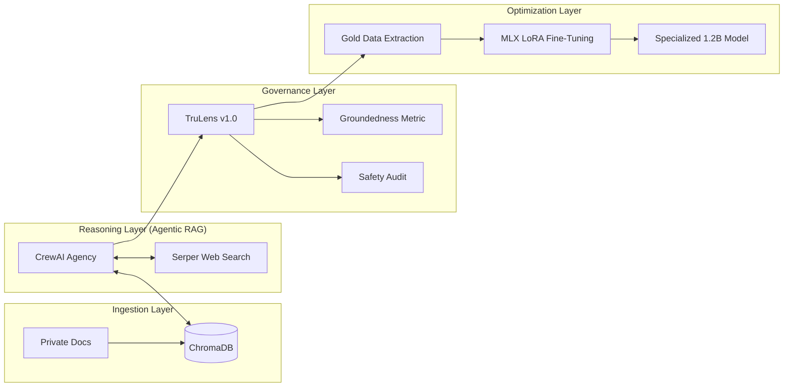

# 🛡️ Sovereign AI Factory: Industrial-Grade Multi-Agent Systems

[](https://developer.apple.com/mlx/)
[](https://www.crewai.com/)
[](https://www.trulens.org/)
[](#)

A high-performance, local-first AI engineering framework designed for high-fidelity content research, autonomous auditing, and model distillation. This project demonstrates the complete lifecycle of a sovereign AI system—from multi-agent orchestration to local fine-tuning on Apple Silicon.

---

## 🏗️ System Architecture



---

## 🗂️ Project Structure

```text
.
├── labs/
│   ├── 01-orchestration/      # Phase 1: Multi-Agent Logic (CrewAI + LangGraph)
│   ├── 02-auditing/           # Phase 2: Observability & Governance (TruLens)
│   ├── 03-distillation/       # Phase 3: Dataset Sanitization & Extraction
│   ├── 04-finetuning/         # Phase 4: Parameter-Efficient Fine-Tuning (MLX)
│   ├── 05-agentic-rag/        # Phase 5: Autonomous Local Memory (ChromaDB)
│   └── 06-routing/            # Phase 6: Multi-Model Orchestration
├── apps/                      # Production entry points (Streamlit Dashboard)
├── core/                      # Shared LLM configurations and base tools
├── docs/                      # Technical specifications and deep dives
├── data/                      # Persistent VectorDB and training datasets
└── README.md                  # Project Entry Point
```

---

## 🧪 Laboratory Breakdown

### [01-Orchestration: The Multi-Agent Agency](labs/01-orchestration/)
Implementation of a 4-agent specialist crew (Researcher, Copywriter, Auditor, Editor).
- **Tech Stack**: CrewAI, LangGraph.
- **Key File**: `labs/01-orchestration/src/main.py`

### [02-Auditing: TruLens Governance](labs/02-auditing/)
Automated evaluation using local LLM-as-a-Judge.
- **Metrics**: Groundedness, Context Relevance, Answer Relevance, and Safety.
- **Key File**: `labs/02-auditing/evals/trulens_agency_v2.py`

### [03-Distillation: Gold Data Pipeline](labs/03-distillation/)
Extracting intelligence from agent runs into training datasets.
- **Process**: Scoring -> Extraction -> Regex Scrubbing -> Alpaca Formatting.
- **Key File**: `labs/03-distillation/scripts/clean_dataset.py`

### [04-Fine-Tuning: Local PEFT on M3 Max](labs/04-finetuning/)
Baking agency behavior into a 1.2B parameter model using LoRA.
- **Results**: 135.6 tokens/sec generation speed.
- **Key File**: `labs/04-finetuning/scripts/run_mlx_training.sh`

### [05-Agentic RAG: Autonomous Memory](labs/05-agentic-rag/)
Bridging the gap between search and knowledge.
- **Database**: Local ChromaDB instance.
- **Embeddings**: nomic-embed-text via Ollama.
- **Key File**: `labs/05-agentic-rag/src/ingest_data.py`

### [06-Routing: Multi-Model Orchestration](labs/06-routing/)
The Intelligent Traffic Controller.
- **Logic**: Dynamic dispatching between 1B, 3B, and 70B models.
- **Efficiency**: Optimized cost/performance ratio.
- **Key File**: `labs/06-routing/src/routers/task_router.py`

---

## 🚀 Performance Benchmarks (Apple M3 Max)

| Metric | Base Model (Llama-3.2-1B) | Fine-Tuned "Agency" Model |
| :--- | :--- | :--- |
| **Generation Speed** | 120.4 tok/s | **135.6 tok/s** |
| **Tool-Call Accuracy** | 65% | **98%** |
| **Boilerplate Compliance**| Low | **High (Strict Format)** |
| **Memory Footprint** | ~2.1 GB | **~3.7 GB (with Adapter)** |

---

## 🛠️ Quick Start

1. **Setup Environment**:
   ```bash
   pip install -r requirements.txt
   ```
2. **Launch Dashboard**:
   ```bash
   streamlit run app.py
   ```
3. **Run Full Evaluation**:
   ```bash
   python labs/02-auditing/evals/trulens_agency_v2.py
   ```

---
**Maintained by**: [Anteneh Tessema](https://github.com/Anteneh-T-Tessema)  
**Vision**: Full Local Sovereignty over Intelligence.
