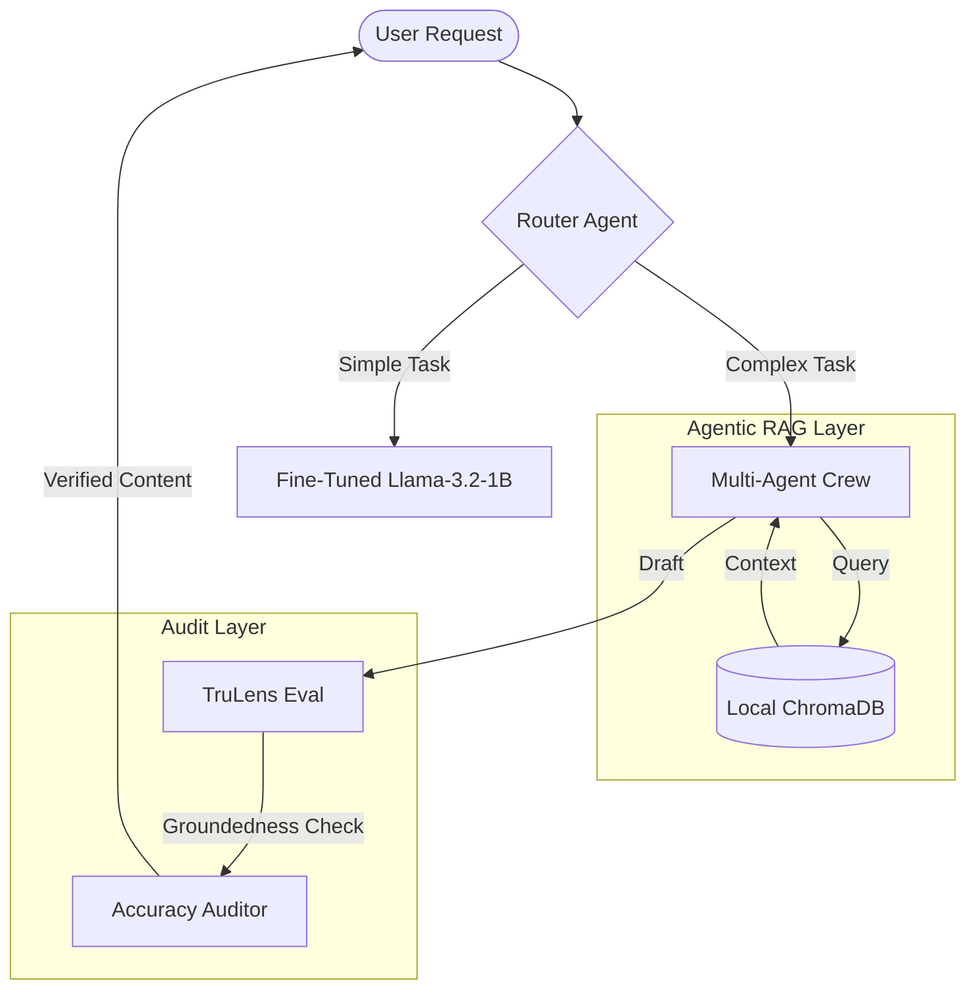

# Sovereign AI Factory: Industrial Multi-Agent Systems

A high-performance, local-first AI engineering portfolio demonstrating the evolution of autonomous agents, multi-metric evaluation, and knowledge distillation via local fine-tuning on Apple Silicon (M3 Max).

---

## 🏗️ Architecture Overview

## 🛠️ Engineering Labs

### [Lab 01: Orchestration](labs/01-orchestration/)
Implementation of specialized multi-agent systems using **CrewAI** and **LangGraph**. Focus on role-based reasoning and inter-agent communication.

### [Lab 02: Auditing & Governance](labs/02-auditing/)
Operationalizing trust. Integration of **TruLens v1.0** for multi-metric evaluation:
- **Groundedness**: Cross-referencing claims against source research.
- **Safety**: Harmfulness and maliciousness detection.
- **Relevance**: Dynamic feedback loops for output optimization.

### [Lab 03: Knowledge Distillation](labs/03-distillation/)
Pipeline for extracting "Gold Standard" datasets from successful agent runs. Includes automated data scrubbing and sanitization of LLM tool-hallucinations.

### [Lab 04: Local Fine-Tuning (MLX)](labs/04-finetuning/)
PEFT (Parameter-Efficient Fine-Tuning) using **LoRA** on Apple Silicon. 
- **Hardware**: Optimized for M3 Max Unified Memory.
- **Framework**: MLX-LM.
- **Result**: 135+ tokens/sec on a specialized 1.2B parameter "Agency" model.

### [Lab 05: Agentic RAG & Memory](labs/05-agentic-rag/)
Development of autonomous retrieval strategies. Agents move beyond simple search to "multi-hop" reasoning across local vector databases (ChromaDB) and private document stores.

---

## 🚀 Deployment Standards
- **Model Formats**: GGUF, MLX Adapters.
- **Environment**: Containerized local execution with **Ollama**.
- **Observability**: OpenTelemetry-based tracing (TruLens).

---
**Lead Engineer**: Anteneh Tessema  
**Focus**: Sovereign AI, Local-First Infrastructure, Multi-Agent Autonomy.
